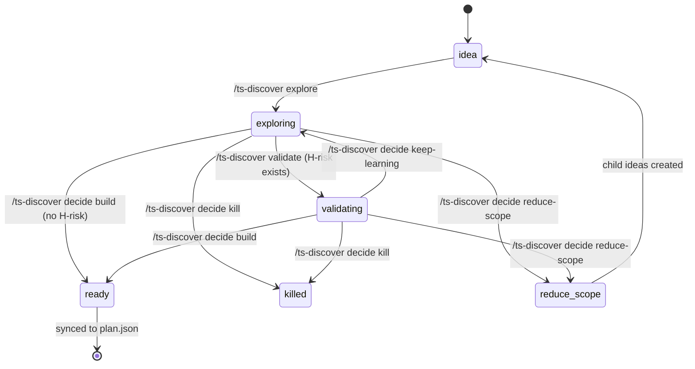

# Discovery Kanban Reference

Defines stage entry/exit criteria, WIP limits, stale rules, and the dedup
algorithm for the `/ts-discover` command family.

---

## State Transition Diagram

---

## Stage Entry / Exit Criteria

### `idea`
- **Entry:** Seeded by `/ts-project plan --new` (batch) or `/ts-discover idea` (single). Also created by `--from-router` feedback hook or as child of `reduce-scope`.
- **Exit:** `/ts-discover explore <id>` moves to `exploring`.
- **No minimum stay.** Lowest-priority ideas may remain here indefinitely.

### `exploring`
- **Entry:** `/ts-discover explore` runs:
  - ts-event-storming-facilitator → `domain_events`, `aggregates`
  - ts-acpl problem-frame-map → `acpl_pattern_group`
  - first-principles-agent → `riskiest_assumptions[]`
  - `exploration_output` populated
- **Exit (to validating):** If `riskiest_assumptions` contains at least one `H`-risk item, `/ts-discover validate` is required before `decide build`.
- **Exit (to ready — validation skip):** If `riskiest_assumptions` contains zero `H`-risk items, `/ts-discover decide build` is allowed directly. Note records "validation skipped — low uncertainty."
- **Exit (to killed / reduce-scope):** `/ts-discover decide kill` or `reduce-scope` allowed from here.
- **Counts toward WIP limit.**

### `validating`
- **Entry:** `/ts-discover validate` runs:
  - council-advisor evaluates H-risk assumptions
  - tows-strategy-analyst assesses strategic fit
  - `validation_output` populated with `feasibility` + `rationale`
- **Exit:** `/ts-discover decide <id> [build|kill|keep-learning|reduce-scope]`
  - `build` → `ready` (if feasibility = feasible)
  - `kill` → `killed` (ADR written)
  - `keep-learning` → back to `exploring` (keep_learning_count++)
  - `reduce-scope` → `reduce-scope` (child ideas created)
- **Counts toward WIP limit.**

### `ready`
- **Entry:** `/ts-discover decide <id> build`. `ready_epics[]` populated with epic IDs.
- **Exit:** `/ts-project plan --sync` marks `synced_to_plan=true` and creates corresponding epic(s) in `plan.json`.
- **Does NOT count toward WIP limit.**
- Epic is NOT in plan.json until sync — discovery.json is the buffer.

### `killed`
- **Entry:** `/ts-discover decide <id> kill`.
- **Side effect:** ADR written to `.ai/decisions/ADR-NNN.md` documenting kill rationale.
- **Terminal state.** Entry remains in discovery.json for audit trail. Never deleted.

### `reduce-scope`
- **Entry:** `/ts-discover decide <id> reduce-scope`.
- **Side effect:** N child ideas created with `status=idea`, IDs derived from parent (e.g. `idea-001a`, `idea-001b`).
- **Audit trail:** Parent `notes` = "split into idea-001a, idea-001b". Child `notes` = "split from idea-001". Bidirectional links.
- **Terminal for parent.** Children re-enter the pipeline as `idea`.

---

## WIP Limit

- **Scope:** `exploring` + `validating` combined.
- **Limit:** 3 concurrent.
- **Enforcement:** `/ts-discover explore` blocked when WIP at capacity.
  Returns: "WIP limit reached (3/3) — finish or defer an in-flight idea first."
- **Rationale:** Keeps discovery focused. Matches "lots of discovery loops should
  fit in a sprint" — 3 concurrent is a reasonable solo/small-team ceiling.

### Boundary cases
| exploring + validating count | `/ts-discover explore` allowed? |
|---|---|
| 0, 1, 2 | ✅ Yes |
| 3 | ❌ Blocked — "WIP limit reached (3/3)" |
| >3 (should not occur) | ❌ Blocked — surface warning for data integrity check |

---

## Stale Rule

- **Threshold:** `keep_learning_count >= 3` on a single idea.
- **Effect:** `/ts-discover status` flags the idea:
  "stale — 3× keep-learning, decision required"
- **Suggested action:** "Re-run /ts-discover validate with updated assumptions,
  or /ts-discover decide <id> [build|kill|reduce-scope]"
- **Advisory, not blocking.** Human can override by forcing a decision. Some
  legitimately hard problems may need more learning loops.

### Boundary cases
| keep_learning_count | Stale flag? |
|---|---|
| 0, 1, 2 | No |
| 3 | Yes — "stale — 3× keep-learning, decision required" |
| >3 | Yes — still flagged on every status check |

---

## Dedup Algorithm (for `--from-router` ideas)

When ts-deliver-router calls `/ts-discover idea --from-router`, a dedup check
runs before creating a new entry.

### Algorithm
1. Normalize incoming `description`: lowercase, remove stopwords, strip punctuation.
2. For each existing idea in discovery.json:
   a. Normalize `title` the same way.
   b. Compute token overlap ratio: `|intersection| / |union|` of word sets.
3. If any existing idea has overlap ratio ≥ 0.6 (threshold):
   - **Match found.** Do NOT create new entry.
   - Append to matched idea's `notes`: "duplicate feedback received from <source_epic> on <date>"
4. If no match:
   - Create new entry with `status=idea`, `source_epic` set.

### Edge cases
- **Same idea, very different phrasing:** False negative (new entry created).
  Known limitation — semantic similarity check is a future improvement.
- **Different ideas, similar titles:** False positive (merged into existing).
  Known limitation — human review of notes can disambiguate.
- **Threshold (0.6):** Chosen to balance false positives vs false negatives for
  typical 4–8 word technical descriptions. May need tuning after first real use.
